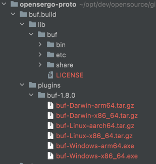

# OpenSergo Proto Definition

提供 OpenSergo gRpc协议 相关的 Proto 定义

# 测试版本

- 本地安装 buf/build 软件，`buf.build/plugins`目录下选择操作系统对应的安装包，解压放到`lib目录`下,并且重命名为`buf`，如图   
  
- 进入`./proto/opensergo`，通过修改`cmd.sh`中的`tag`值进行指定当前`proto`版本号
- 执行`cmd.sh`，将`proto`发布到`buf/build`仓库，[仓库地址 https://buf.build/opensergo](https://buf.build/opensergo)

# 正式版规划
后续可集成`github CI`，进行自动化部署

# 示例Demo    
在项目 [jnan806/opensergo-grpc-stub 的 initial-version 分支](https://github.com/jnan806/opensergo-grpc-stub/tree/initial-version) 中有参考的demo， 主要用于生成`OpenSergo SDK`基于`gRpc协议`的`Stub Code`