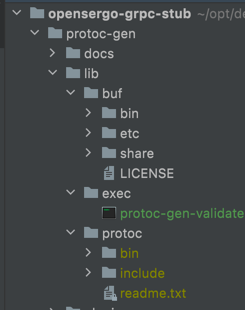

# protoc-gen 环境设置  

  

- `protoc` 环境设置:  将`/protoc-gen/lib/protoc/bin`所在目录配置到环境变量的`PATH`中  
  `protoc-gen/plugins/protoc-21.6`目录下选择操作系统对应的安装包，解压放到`lib目录`下,并且重命名为`protoc`, 此方案默认已配置`PATH`不需自己配置, 如上图  
- `envoyproxy.validate` 环境设置:  将`/protoc-gen/lib/exec/bin`所在目录配置到环境变量的`PATH`中  
  方案一: 本地安装 `envoyproxy.validate` 参考官网 https://github.com/envoyproxy/protoc-gen-validate, 然后配置环境变量 `PATH`  
  ``` go
    # fetches this repo into $GOPATH
    go get -d github.com/envoyproxy/protoc-gen-validate
    # installs PGV into $GOPATH/bin
    make build
  ```
  方案二: Darwin(MacOS系统)将`protoc-gen/plugins/envoyproxy.validate-0.6.8`下我已编译好的文件,移动至`lib/exec目录`下,并且重命名为`protoc-gen-validate`, 此方案默认已配置`PATH`不需自己配置,如上图  
- `protoc 各个语言插件`，需要自行安装 protoc 生成目标语言stub-code的相关插件，并且配置到环境变量 `PATH`  
   go对应插件: `protoc-gen-go`、`protoc-gen-go-grpc`  
   java插件 : `protoc-gen-grpc-java`  
